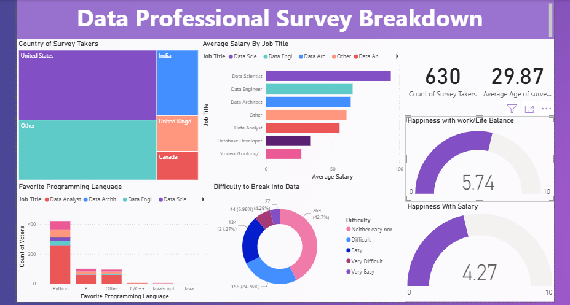
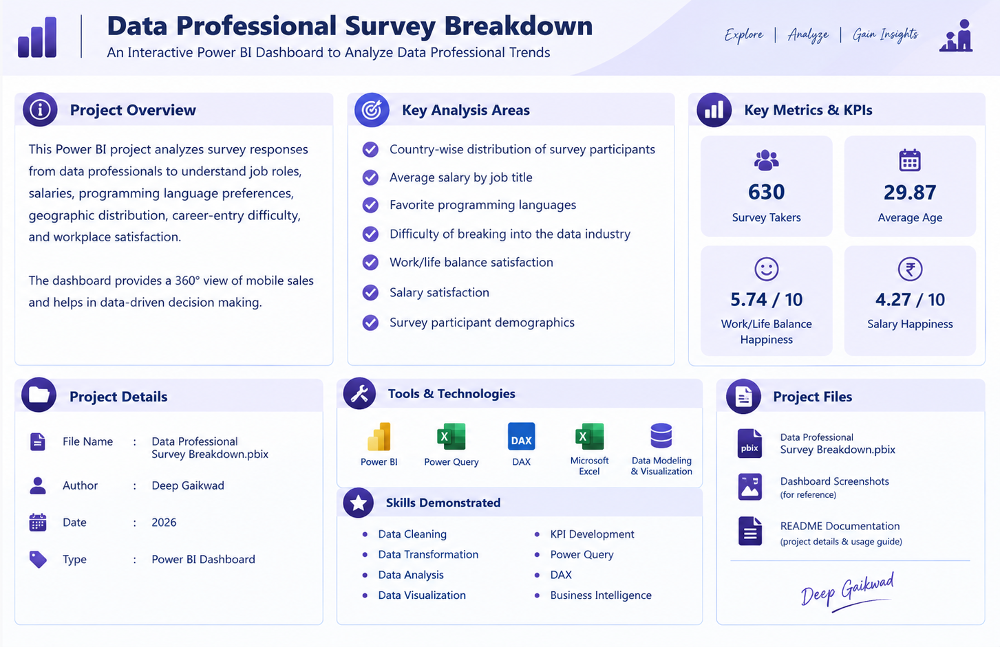

# 📊 Data Professional Survey Breakdown — Power BI Dashboard

An interactive **Power BI Data Analytics Dashboard** built to analyze survey responses from data professionals and understand trends across **job roles, salaries, programming languages, demographics, career entry difficulty, and workplace satisfaction**.

The project transforms survey data into meaningful business insights using **Microsoft Power BI, Power Query, DAX, Microsoft Excel, and data visualization techniques**.

---

## 🎯 Project Overview

The **Data Professional Survey Breakdown** dashboard provides a comprehensive analysis of survey responses collected from data professionals.

The analysis focuses on:

- 🌍 Country-wise distribution of survey participants
- 💼 Job roles and career positions
- 💰 Average salary by job title
- 💻 Favorite programming languages
- 📈 Difficulty of entering the data industry
- ⚖️ Work-life balance satisfaction
- 😊 Salary satisfaction
- 👥 Age and demographic distribution
- 📊 Overall survey participant trends

---

## 📊 Dashboard Preview

### Main Dashboard



The main Power BI dashboard provides an interactive overview of data professional survey responses, including salary, job title, programming language preferences, country distribution, career difficulty, and satisfaction metrics.

---

## 📋 Project Information



The project information page summarizes the objective, key analysis areas, KPIs, tools and technologies, project details, and skills demonstrated throughout the project.

---

## 🎯 Business Questions

This project helps answer important analytical questions:

- How many professionals participated in the survey?
- What is the average age of survey participants?
- Which countries have the highest number of participants?
- Which job titles have higher average salaries?
- Which programming languages are most preferred?
- How difficult is it to enter the data industry?
- How satisfied are professionals with their work-life balance?
- How satisfied are professionals with their salaries?
- What patterns can be identified across job roles and demographics?

---

## 🛠️ Tools & Technologies

| Tool / Technology | Purpose |
|---|---|
| 🟦 Microsoft Power BI | Dashboard development and visualization |
| 🟨 Power Query | Data cleaning and transformation |
| 📐 DAX | Measures, KPIs and calculations |
| 📊 Microsoft Excel | Dataset preparation and source data |
| 📈 Data Visualization | Charts, KPIs and analytical reporting |
| 🧠 Data Modeling | Organizing and analyzing survey data |

---

## 📈 Key KPIs

| KPI | Value |
|---|---:|
| 👥 Survey Takers | 630 |
| 🎂 Average Age | 29.87 |
| ⚖️ Work-Life Balance Happiness | 5.74 / 10 |
| 💰 Salary Happiness | 4.27 / 10 |

---

## 🌍 Country Distribution

The dashboard analyzes the geographical distribution of survey participants across different countries.

This analysis helps understand the representation of data professionals across different regions.

---

## 💼 Average Salary by Job Title

The dashboard compares average salary across different data-related job roles, including:

- Data Scientist
- Data Engineer
- Data Architect
- Data Analyst
- Database Developer
- Student / Looking for a Job
- Other

This provides a comparative view of salary levels across different professional roles.

---

## 💻 Favorite Programming Languages

The project analyzes programming language preferences among survey participants.

Languages analyzed include:

- Python
- R
- Other
- C/C++
- JavaScript
- Java

---

## 🚪 Difficulty of Breaking into the Data Industry

The dashboard analyzes how respondents perceive the difficulty of entering the data industry.

Difficulty levels include:

- Neither easy nor difficult
- Difficult
- Easy
- Very Difficult
- Very Easy

---

## ⚖️ Work-Life Balance Analysis

The dashboard measures respondents' satisfaction with their work-life balance.

**Work-Life Balance Happiness: 5.74 / 10**

This KPI provides an overall view of work-life balance satisfaction among survey participants.

---

## 💰 Salary Satisfaction Analysis

The dashboard also analyzes salary satisfaction among respondents.

**Salary Happiness: 4.27 / 10**

This metric provides an overall view of salary satisfaction across the surveyed professionals.

---

## 📐 DAX & Data Analysis

DAX measures were created to support KPI development and analytical reporting.

### Survey Takers

```DAX
Survey Takers =
COUNTROWS('Data Professional Survey')

---

Additional calculations were used for:

Survey participant counts
Average age
Salary analysis
Satisfaction metrics
Job title analysis
Programming language analysis
Demographic analysis
🔄 Project Workflow
Survey Dataset
      ↓
Data Cleaning
      ↓
Data Transformation
      ↓
Power Query
      ↓
Data Modeling
      ↓
DAX Measures
      ↓
Data Visualization
      ↓
Interactive Power BI Dashboard
      ↓
Business Insights
🧠 Skills Demonstrated
Power BI
Dashboard Development
Interactive Visualization
KPI Development
Business Intelligence
Report Design
Power Query
Data Cleaning
Data Transformation
Data Preparation
Data Shaping
DAX
Measure Creation
KPI Calculations
Aggregations
Analytical Calculations
Data Analytics
Exploratory Data Analysis
Survey Analysis
Salary Analysis
Demographic Analysis
Comparative Analysis
Data Visualization
Business Insights
🎓 Learning Outcomes

This project demonstrates practical experience in:

Building professional Power BI dashboards
Cleaning and transforming datasets
Creating DAX measures
Developing KPI cards
Analyzing survey data
Creating interactive visualizations
Performing salary analysis
Performing demographic analysis
Analyzing programming language preferences
Presenting analytical findings in a business-friendly format
📂 Project Structure
Data-Professional-Survey-Breakdown/
│
├── images/
│   ├── Dashboard.png
│   └── Dashboard_Information.png
│
├── Data Professional Survey Breakdown.pbix
│
├── Dataset.xlsx
│
└── README.md
🚀 How to Use
Step 1

Install Microsoft Power BI Desktop.

Step 2

Open the Power BI file:

Data Professional Survey Breakdown.pbix

Step 3

Refresh the dataset if required.

Step 4

Explore the interactive dashboard and analyze:

Countries
Job Titles
Salaries
Programming Languages
Career Difficulty
Work-Life Balance
Salary Satisfaction
⭐ Project Highlight

The Data Professional Survey Breakdown project demonstrates how survey data can be transformed into an interactive Business Intelligence solution using Power BI, Power Query, DAX, and data visualization.

The dashboard combines multiple analytical perspectives into a single reporting solution, making it easier to understand trends and patterns across the data professional landscape.

👨‍💻 Author

Deep Gaikwad

Aspiring Data Analyst

Excel | SQL | Python | Power BI | DAX | Power Query | Data Analysis | Data Visualization

📊 Project Category

Data Analytics | Business Intelligence | Power BI | Data Visualization

⭐ If you find this project useful, consider giving the repository a star.
